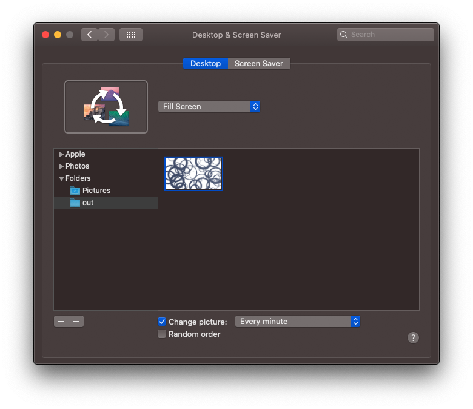

# JavaScript Generative Wallpapers

## Samples
You can find some generated samples [here](samples).

## Setup
Install dependencies, then test that the generator is working. This should generate a wallpaper at `out/[timestamp].png`:
```sh
npm install && npm run generate
```

Next, add a `crontab` rule to run the generator script at an interval you'd like (e.g. every minute):
```sh
crontab -e

# Add to crontab file
* * * * * /path/to/generate.sh
```

Finally, point your OS to the `out` folder and tell it to cycle at the same interval set in your crontab:


## Customisation

### Modifying the existing generators
There are currently four different generators in this repo: maze, triangles, circles and a fractal generator. Generator files are written in JavaScript and can be found in the `generators` folder.

Each generator can be tweaked by playing with the constants defined at the top of tile file. For example, tweaking `CELL_SIZE` in the `generators/triangles.js` generator will make the triangles larger or smaller.

### Writing your own generators
See `generators/template.js` for a barebones example, but basically you're given a 2D canvas context and can do whatever you'd like with it. Most HTML5 canvas methods are supported; see the [canvas](https://www.npmjs.com/package/canvas) package on NPM for more information.

Check out the existing generators for inspiration, and if you write one you're proud of please submit a PR!

### Mix & match generators
The first few lines in `generate.sh` define a set of generators to pick from at random every time the script is run. Mix & match generators to your liking!
